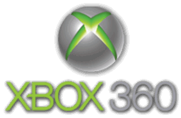

<p align="center">
	
</p>

# NXE Dashboard Recompilation

A static recompilation of the Xbox 360 NXE dashboard (2.0.9199.0) for native
Windows, built on the [ReXGlue](https://github.com/) SDK. The dashboard's
PowerPC code is translated to C++ ahead of time. The code in `src/` is the
practical layer around it: kernel hooks, storage, profiles, the game library,
title launching, and the pieces of the shell that have no PC equivalent.

## What this repository does not contain

**No Microsoft code or data, and no game content.** To run this you supply your
own files:

- A 9199 system update dump (`$flash_dash.xex` and the packages beside it)
- Your own Xbox 360 profile and content, if you want your gamertag and saves
- Cover art and icons for your own games

`generated/` contains the several hundred megabytes of C++ that ReXGlue
produces from `$flash_dash.xex`. It is deliberately not committed because it is
derived from Microsoft's executable. Anyone with their own dump can reproduce
it with one command.

## Prerequisites

- Windows, CMake 3.25+, Clang (LLVM), Ninja
- The ReXGlue SDK, built and installed
- A 9199 `$SystemUpdate` dump
- The [Avatar Editor Recomp](https://github.com/panedivitasei/AvatarEditorRecomp),
  required to edit avatars

### SDK patches

`patches/` holds changes this project needs in the SDK. Four are genuine runtime
bugs found while building this, and the dashboard will not work correctly
without them:

| Patch | What it fixes |
| --- | --- |
| `xboxkrnl_io_cpp_trailingsep.patch` | `NtCreateFile` refusing a path with a trailing separator |
| `entry_cpp_emptycomponent.patch` | `Entry::ResolvePath` failing on an empty component, so no mount root could ever resolve |
| `virtual_file_system_cpp_mountroot.patch` | `OpenFile` asking a parent for a child that is itself a mount point |
| `xex_module_cpp_retryalloc.patch` | The two-key XEX retry leaking the image reservation, so the second key was never really tried |
| `xboxkrnl_memory_cpp_debugmemory.patch` | Devkit-memory asserts killing the process where the allocator only warns |
| `xam_avatar_cpp_byxuid.patch` | Avatar asset pack selection |

Apply them against the SDK checkout before building it:

```
cd <rexglue-sdk>
git apply <this-repo>/patches/*.patch
```

## Building

Generate the recompiled sources from your dump, then build:

```
rexglue codegen nxe_dash_manifest.toml
cmake --preset win-amd64-debug
cmake --build out/build/win-amd64-debug --target nxe_dash
```

`nxe_dash_manifest.toml` points at the dump; edit its paths to match yours.

## Laying out the data

Paths are resolved against the **installation root**, meaning the directory
that contains the executable unless `nxe_root` says otherwise. A working
installation looks like this:

```
NXE.exe
gamedir/        staged game directory: default.xex, the .xzp packages, fonts
gamedir/sharedres/  loose overrides for shared resources
storage/        Content/, xconfig.bin -- the console storage tree
assets/covers/  cover art, named <titleid>.png
assets/icons/   game icons, named <titleid>.png
```

Anything absolute in a config file or on the command line wins over these, so
the data can live wherever you like:

```
NXE.exe -storage_root="D:/Xbox360Storage" -game_art_dir="D:/covers"
```

### Optional settings

| Setting | Purpose |
| --- | --- |
| `game_emulator` | Emulator run when a game is launched. Empty disables launching. |
| `boot_video` | Video played over the loading dashboard. Empty disables it. |
| `avatar_editor_exe` | The avatar editor recompilation, a separate project. |
| `guide_enable` | Route the Guide into real recompiled XAM. Off: it corrupts the heap during start-up. |

Editing avatars requires the separate Avatar Editor Recomp project. Get it from
the [Avatar Editor Recomp GitHub repository](https://github.com/panedivitasei/AvatarEditorRecomp),
build it, and point `avatar_editor_exe` at its executable.

Note that `NXE.toml` is rewritten from cvar state when the dashboard exits, so
hand-edited entries in it do not survive a run. Use the command line for
anything you want to stick.

## First-run setup

On a new install the dashboard reports missing paths instead of failing
silently. The setup dialog can be opened during first run, and can be opened
again with `F7` when paths or tools need to be changed. It covers the profile,
themes, avatar data, staged games, artwork, and optional launch helpers.

The Game Library can contain both Xbox 360 and PC games:

- Put Xbox 360 game folders containing `default.xex` under `roms_dir`, then
  refresh the library. The title ID is read from the XEX execution metadata;
  the game is staged without copying its files.
- Point `full_games_dir` at a folder of PC game directories or a Steam library.
  Steam manifests are read for names and app IDs; ordinary folders use a
  detected executable. PC titles launch directly, while Xbox 360 titles use
  `game_emulator`.

## Keybinds

| Key | Action |
| --- | --- |
| `F3` | Opens the Debug Overlay. |
| `F4` | Opens the Settings Menu. |
| `F6` | Refreshes the Game Library. |
| `F7` | Opens the Dashboard Setup. |
| `F8` | Opens the Disc Drive and Profiles. |
| `F9` | Opens Achievements. |

## Data tools

The scripts in `tools/` import local profile data and retrieve optional Xbox
Live, marketplace, achievement, social, cover, and video data. The combined
workflow is:

```
python tools/xbl_auth.py
python tools/sync_all.py
python tools/import_profile.py
python tools/import_gamerpics.py
python tools/import_genre_cards.py
```

Run individual `fetch_*.py` scripts when only one data set is needed. The Xbox
Live token is cached in `tools/.xbl_token.json`; the video importer can use a
TMDB key in `tools/.tmdb_key`. Both files are ignored by Git and must never be
committed. Review each script's `--help` output for source and destination
overrides before importing data.

## State of things

Working: boot, themes, profile and gamercard, the game library with real sizes
and artwork, achievements with icons, launching titles through an emulator and
returning, the disc tile with cover art, Discord rich presence.

Partial: the Guide. Pressing Messages opens a real dashboard scene rather than
XAM's Guide. The authentic blades live in `huduiskin.xex`, which this runtime
cannot decrypt. Running real XAM gets through start-up but corrupts the
runtime's heap, so it remains behind `guide_enable` for now.

## Known issues

The following issues are currently being worked on and will be fixed in future
updates:

- Exiting the Game Library can freeze the application.
- The Video Library does not work yet.
- The Music Library opens, but its functionality is not working yet.
- The Picture Library opens, but its functionality is not working yet.
- Windows Media Center works, but cannot connect because Xbox Live is not fully
	connected to that part of the dashboard yet.
- Changing the display resolution in Settings currently has no effect.
- Spotlight navigation is incomplete. Most items do not respond, and opening
	Demos redirects to the Game Library; backing out from there can freeze the
	application.

## Credits

- [ReXGlue SDK](https://github.com/rexglue/rexglue-sdk)
- [panedivitasei](https://github.com/panedivitasei)
- [XenosRecomp](https://github.com/hedge-dev/XenosRecomp)

## License

This project is dedicated to the public domain under the terms of [CC0 1.0
Universal](LICENSE). It carries no Microsoft code and no game content, and
nothing here distributes either.
